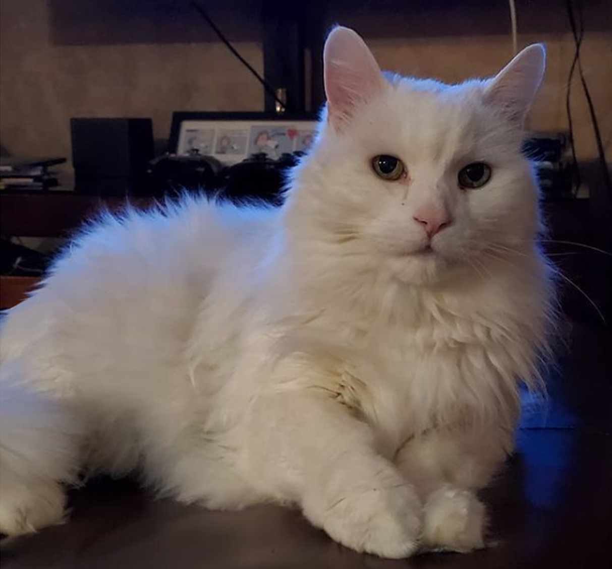
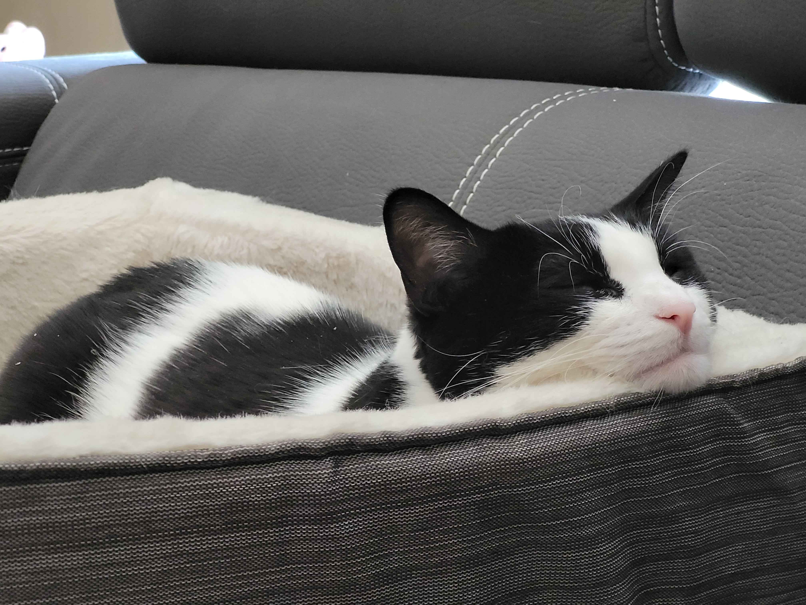

# Hello! I am Carolina Henriquez Silva

## I am a creative girl, who has a love for computers. I also love my cats!

I am 26 years old, and have always had a fascination for games, media, and art. I studied to be an animator for one year at VANARTS (Vancouver Institute of Media Arts). There I learned ToonBoom Harmony, an animation program and was able to work in the animation industry for six years, before changing my focus to studying Web Development.
In Web Development I hope to carry over my skills as a creative and finally link the logical part of me. I love problem solving and making things work efficiently, and can imagine myself really enjoying this profession.

### extra content!

My old family cat, Sethy. He has sadly since passed.

This is my boyfriends cat, whom I have now taken in as my own. You've likely seen her if you're viewing this!

I just wanted to show you my loves.

I am 26 years old. I studied 2D character animation in the past, and really enjoyed it. Now I'm excited to be learning more things in web development!
